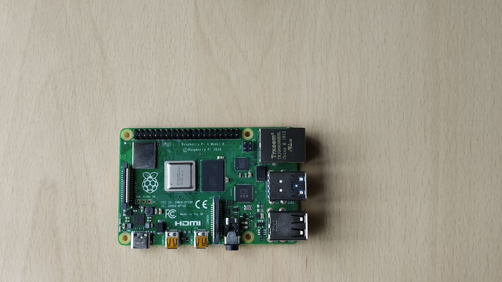

# Interfacing 'ADXL335 (accelerometer) sensor' with 'Raspberry Pi 4' using Shunya Interfaces





## Introduction

We are going to interface an ADXL335 (accelerometer) sensor on Raspberry Pi 4 
with Shunya O/S using Shunya Interfaces library.

ADXL3xx accelerometer module is an analog device, so we need an ADC 
(analog to digital converter) to convert analog values to digital. 
In this we have used pcf8591 ADC.


# Materials required :
- Raspberry Pi 4B
- Raspberry Pi 4B compliant power supply
- 8GB or bigger micro SD card

# Connections :


There are 5 pins to ADXL3xx accelerometer module
1. VCC (also called 5V) - Connect it to 3.3V or 5V on the dev Board
2. GND (also called GND) - Connect it to GND on the dev Board
3. X_out - Connect it to any Analog pin on the pcf8591 module
4. Y_out - Connect it to any Analog pin on the pcf8591 module
5. Z_out - Connect it to any Analog pin on the pcf8591 module

> Note: The Analog pin number of the pcf8591 module that you have 
connected to, These will be used as arguments for pcf8591Read() function 
in the code below.

There are 4 pins on the pcf8591 which need to be connected to the dev board.
1. VCC (also called 5V) - Connect it to 3.3V or 5V on the dev Board
2. GND (also called GND) - Connect it to GND on the dev Board
3. SDA - Connect it to SDA pin on dev Board
4. SCL - Connect it to SCL pin on dev Board

- Connection between raspberrypi and pcf8591 


| PCF8591 |     -    |Raspberry Pi 4 |
| ------  | ---- |------- |
| SDA     | <---->  | Pin 3 |
| SCL     | <---->  | Pin 5 |
| VCC     | <---->  | Vcc |
| GND     | <-----> | GND |

- Connection between pcf8591 and ADXL355

| PCF8591 |   -     |ADXL355 |
| ------  |  ----   |------- |
| Ain1    | <---->  | X |
| Ain2    | <---->  | Y |
| Ain3    | <---->  | Z |


# Procedure 

## Step 1: Install Shunya OS on Raspberry pi 4
1. Download Shunya OS from the [official release site](http://shunyaos.org/beta-release/)
2. Shunya OS guys have a decent tutorial on [Flashing Shunya OS on Raspberry Pi 4.](http://docs.shunyaos.org/boards/Raspberry-Pi-4.ht)
3. Insert micro SD card into Raspberry Pi 4


## Step 2: Install Shunya Interfaces
1. Connect to the wifi using the command
```
    $ nmtui
```
2. Installing the Shunya Interfaces is easy, just run the command  
```   
    $ sudo apt install shunya-interfaces
```

# Code :

```c

#include<stdio.h>
#include<stdlib.h>

#include<shunyaInterfaces.h>
#include<pcf8591.h>


void main(){
        int x,y,z;
        /*Initialize Shunya Interfaces library*/
        shunyaInterfacesSetup();
        pcf8591Setup();
        while (1)
        {
                x = pcf8591Read(A1);
                y = pcf8591Read(A2);
                z = pcf8591Read(A3);
                /* Reading converted value at pins of ADC whose addresses 
                 * are given by 0x01, 0x10, 0x11
                 */
                printf("X pin : %d\n",x); 
                delay(100);
                printf("Y pin : %d\n",y); 
                delay(100);
                printf("Z pin : %d\n",z);
                delay(1000);
        }
}

```

## Save the code
Save the code in .c


## Compile
1. Open terminal
2. Run command 

```
    $ gcc -o accelerometer-example accelerometer-example.c 
    $ -lshunyainterfaces
```

## Run 
1. Open terminal 
2. Run command

```
    $ ./accelerometer-example
```

# Credits :

Check out this cool new library for creating your own iot projects - [Shunyainterfaces](https://github.com/shunyaos/Shunya-Interfaces)

Checkout this blog : [Interface ADXL335 Sensor on Raspberry Pi 4B in 4 Steps](https://www.instructables.com/id/Interface-ADXL335-Sensor-on-Raspberry-Pi-4B-in-4-S/)

[@ShunyaOS](http://shunyaos.org/) || [@iotiot.in](http://iotiot.in/)

#
