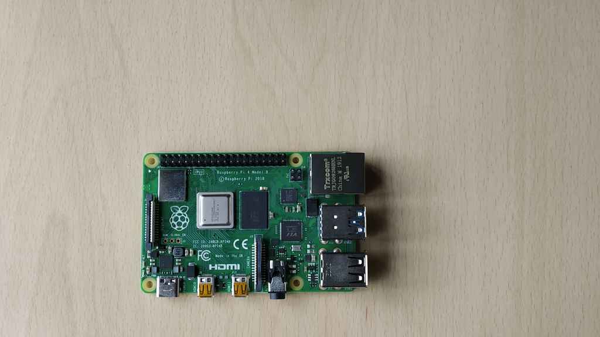

# Interfacing 'HC-SR04 (Ultrasonic) sensor' with 'Raspberry Pi 4' using Shunya Interfaces





## Introduction

We are going to interface an HC-SR04 (Ultrasonic) sensor on Raspberry Pi 4 with Shunya O/S using Shunya Interfaces library.


# Materials required :
- Raspberry Pi 4B
- Raspberry Pi 4B compliant power supply
- 8GB or bigger micro SD card
- HC-SR04 (Ultrasonic) sensor


# Connections :


There are 4 pins to Ultrasonic sensor module HC-SR04
1. VCC (also called 5V) - Connect it to 3.3V or 5V on the dev Board
2. GND (also called GND) - Connect it to GND on the dev Board
3. Trigger - Connect it to any GPIO pin on the dev Board
4. Echo - Connect it to any GPIO pin on the dev Board

> Note: The physical pin number of the GPIO pins that you have connected to and
```
replace
#define triggerPin 40 with
#define triggerPin <your-GPIO-pin-number> and
#define echoPin 38 with
#define echoPin <your-GPIO-pin-number> in the code below.
```

> NOTE: Adding any sort of delay to print the values of distance can cause
issues with output being displayed as 0.

- Connection between raspberrypi and HC-SR04

| HC-SR04  | <-----> | Raspberry Pi 4 |
| ------   |  -----  |     -------    |
| TRIG     | <-----> |      GPIO      |
| ECHO     | <-----> |      GPIO      |
| VCC      | <-----> |      Vcc       |
| GND      | <-----> |      GND       |


# Procedure 

## Step 1: Install Shunya OS on Raspberry pi 4
1. Download Shunya OS from the [official release site](http://shunyaos.org/beta-release/)
2. Shunya OS guys have a decent tutorial on [Flashing Shunya OS on Raspberry Pi 4.](http://docs.shunyaos.org/boards/Raspberry-Pi-4.ht)
3. Insert micro SD card into Raspberry Pi 4


## Step 2: Install Shunya Interfaces
1. Connect to the wifi using the command
```
    $ nmtui
```
2. Installing the Shunya Interfaces is easy, just run the command  
```
    $ sudo apt install shunya-interfaces
```

# Code :

```c

#define triggerPin 40
#define echoPin 38

#include "hc-sr04.h"
int main(){
        int distance;
        /*Initialize Shunya Interfaces library*/
	shunyaInterfacesSetup();
        /*Initialize Ultrasonic sensor*/
	ultrasonicSetup(echoPin,triggerPin);

	while(1){
                /*Get Distance from Ultrasonic sensor*/
		distance = measureDistance(echoPin, triggerPin);
		printf("Distance is %d cm \n",distance);
	}
}

```

## Save the code
Save the code in .c


## Compile
1. Open terminal
2. Run command 

```
    $ gcc -o ultrasonic-sensor-example ultrasonic-sensor-example.c -lshunyainterfaces
```

## Run 
1. Open terminal 
2. Run command

```
    $ ./ultrasonic-sensor-example
```

# Credits :

Check out this cool new library for creating your own iot projects - [Shunyainterfaces](https://github.com/shunyaos/Shunya-Interfaces)

[@ShunyaOS](http://shunyaos.org/) || [@iotiot.in](http://iotiot.in/)
